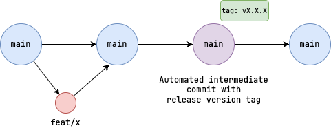

# Software Development Lifecycle

## Developing


## Committing Code

We use [Commitizen](https://commitizen-tools.github.io/commitizen/) to standardize our commit messages according to [Conventional Commits](https://www.conventionalcommits.org/en/v1.0.0/).

Commits should be made against local feature branches, and pull requests should be created to merge changes into `main`.


### Make a Commit

In order to make a commit, simply run:

```shell
make commit
```

## Branching Strategy

We follow [Trunk Based Development](https://trunkbaseddevelopment.com/) practices, enforcing and encouraging short-lived feature branches that are continuously merged into `main` (trunk).



## Versioning

We adhere to [Semantic Versioning (SemVer)](https://semver.org/)

## Testing

<!-- TODO -->

## Building

The backend (core) application is packaged into a single binary, which references the built frontend files

The frontend application is packaged into relevant build files utilizing Vite, output to the `/dist/frontend` directory.

The backend application serves these files according to the logic defined within `/api/frontend/frontend.go`

After the backend build process completes, a Make `copier` is ran. This command copies the contents of `./dist/frontend` to all dist directories, enabling each compiled binary to reference the frontend files at *their* `./frontend`


## Releasing

<!-- TODO -->

Releases are managed via GitHub Releases, with each release tagged according to semantic versioning.

Release branches are created from `main` and merged back into `main` after release completion.

## Deploying

<!-- TODO -->
