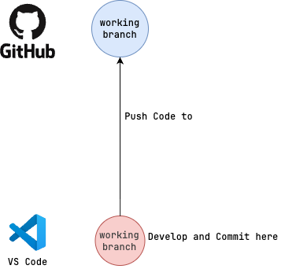

# Committing Code

We use [Commitizen](https://commitizen-tools.github.io/commitizen/) to standardize our commit messages according to [Conventional Commits](https://www.conventionalcommits.org/en/v1.0.0/).

Commits should be made against local feature branches, and pull requests should be created to merge changes into `main`.



## Make a Commit

In order to make a commit, simply run:

```shell
make commit
```
