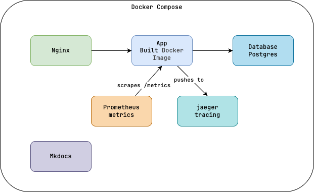

# Development Environment

**Relevant Decision Ref:** [ADR-00008](../decisions/00008_dev_env.md)



- Nginx: Proxy & Load Balancer enabling container communication and routing
- App: Compiled Go backend application container
- Database: Postgres container
- Prometheus: Metrics collection and storage
- Jaeger: Tracing collection and storage
- Mkdocs: Documentation site container

## Utilizing The Dev Environment

```shell
make compose # builds, deploys, and runs development environment
```

Configuration files for the development environment are located in the [deploy/compose](../../../deploy/compose) directory

The `make compose` command targets the `deploy/compose/docker-compose.yml` file, which *includes* the relevant service definitions for the development environment

```shell
deploy/compose/
│   
├── app # application layer
│   └── docker-compose.
│   
├── database # database layer
│   └── docker-compose.postgres.yml
│   
├── docs # documentation layer
│   └── docker-compose.docs.yml
│   
├── network # network layer
│   └── docker-compose.nginx.yml
│   
├── observability # observability layer
│   ├── docker-compose.jaeger.yml
│   └── docker-compose.prometheus.yml
│ 
└── docker-compose.yml # main compose file that ties everything together
```
