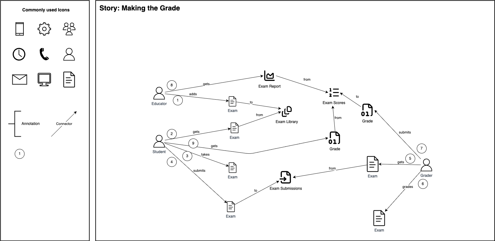

# Making the Grade: Discover

Discover the domain visually and collaboratively.

## Observations

Through the discovery process, we find that we have a fundamental challenge in aligning on developing an ubiquitus language:

- in the business context, the terminology `test` / `testing` refers to the taking of an academic exam by grade school students to determine their academic skills
- in the software context, the terminology `test` / `testing` typically refers to tools and practices to verify functionality of software systems

While at surface level this sounds like it could be a minor detail or a non-issue, it highlights a key challenge in aligning and communicating the business + technology challenges.

For example, let's assume we run into a situation where a business stakeholder and the software product owner are discussing an issue with the system.

Product Owner: "we ran into some issues with testing that caused the outage"

Business Owner: "what does that mean? are the tests gone?"

Product Owner: "oh no, they're still there, we'll just have to redo them"

Business Stakeholder: "well that's going to cause some major issues, do we have any alternatives?"

Product Owner: "hmm, let me talk to the team and get back to you on that"

The Business Stakeholder, then notifies all school administrators across the state that standardized testing will have to be redone. Administrators start preparing various forms of communications to share with teachers, students, parents of students, etc.

Meanwhile, the Product Owner asks the development team if there are any alternate solutions to the challenges they faced with the integration tests that were missed, resuling in an outage. The development team informs the PO that they've already merged the PR addressing the missed tests, in addition to correcting the root cause of the bug.

A few days pass and the PO and Business Stakeholder meet again. The PO is prepared to provide an update to the business stakeholder regarding the missing integration tests and resolution of the bug that caused the outage, while the business stakeholder is prepared to talk about how they're going to have students retake their standardized tests.

This very simplified example is very realistic in the sense of terms how people interpret words and their meaning in the context they perform their job and what they understand the term to mean in their context. The challenge and concept of developing a [Ubiquitous Language](https://martinfowler.com/bliki/UbiquitousLanguage.html), coined particularly to highlight the importance of developing a shared understanding between developers and users, is prevelant in various other business, technical, academic, contexts and something that most people can most likely relate to even in their standard day-to-day lives.

## Decisions

- the terms `Exam`, `Examination`, will serve as common terminology to describe Standardized Tests which are taken by gradeschool students
