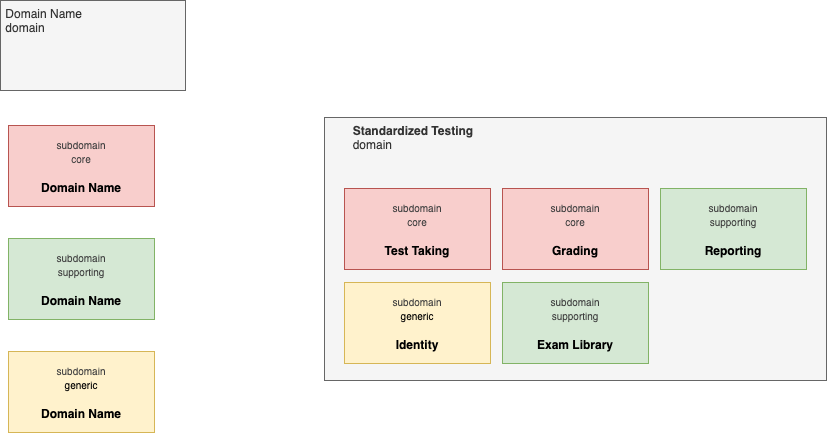
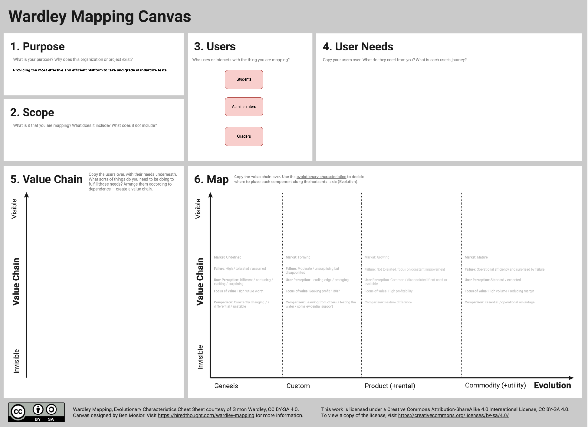

# Strategize

Strategically map out your sub-domains to identify core domains: the parts of the domain which have the greatest potential for business differentiation or strategic significance.

## Subdomains

### Core Subdomains

- Examination: handles taking of standardized tests
- Grading: handles grading of standardized tests
- Reporting: handles generation and management of reports

### Supporting Subdomains

- Exam Library: manages catalog of tests available within the system

### Generic Subdomains

- User Management: handles authentication, authorization, and management of user profiles

## Subdomain Wardley Mapping

