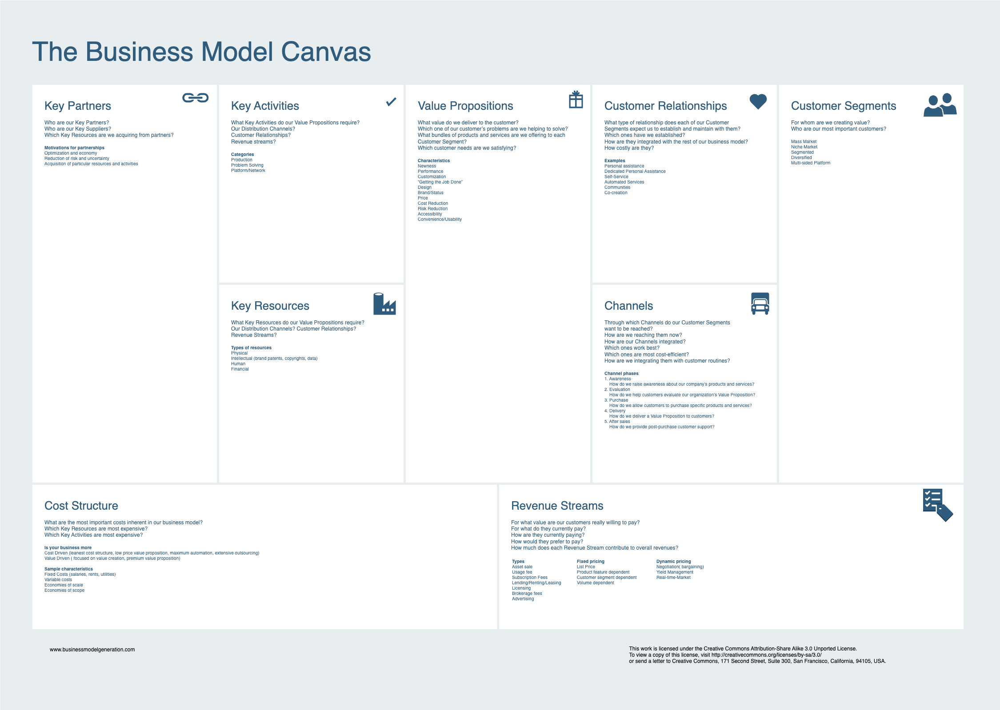
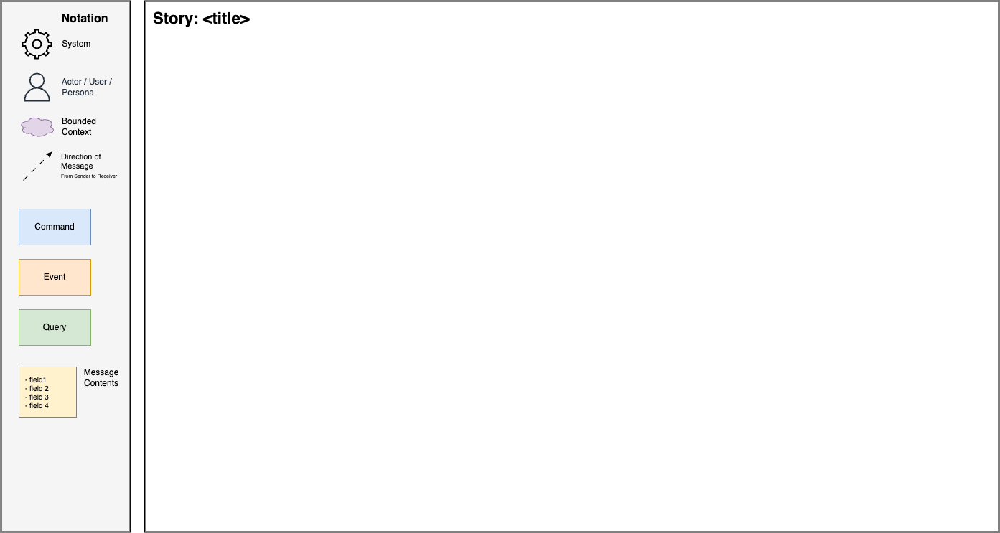
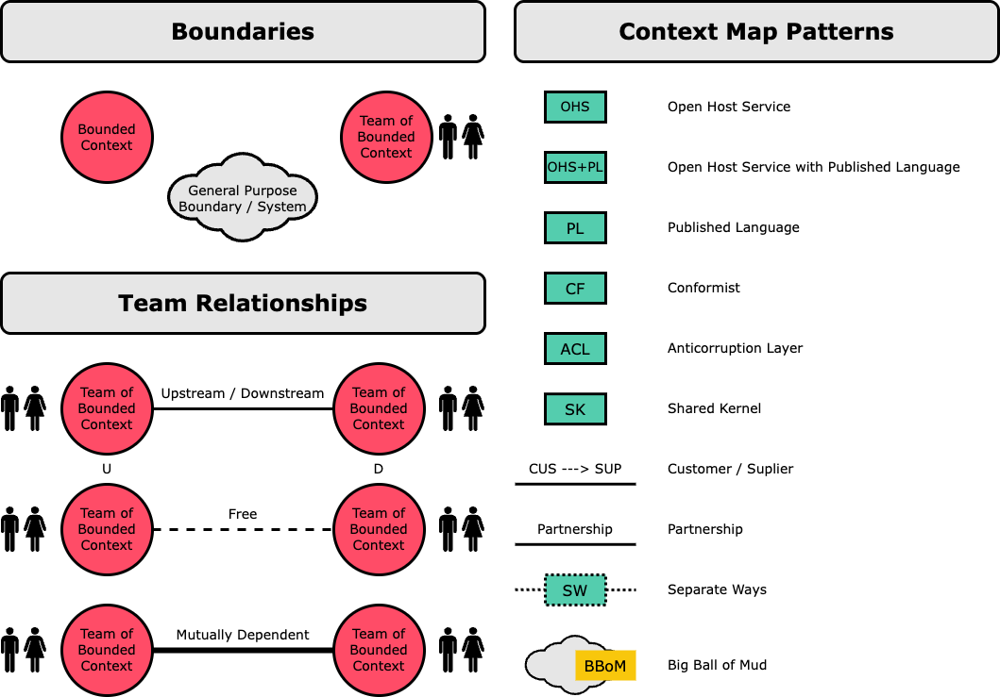
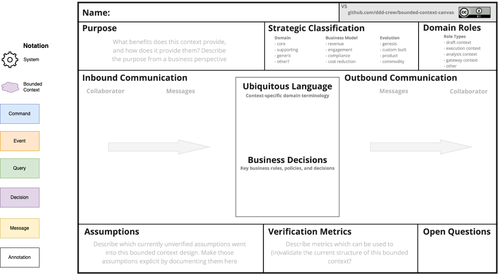

# Domain Modelling

Domain modelling enables us to design our solution across each aspect of Domain-Driven Design practices. For reference material and further information refer to [DDD Crew Domain Modelling](https://github.com/ddd-crew/ddd-starter-modelling-process).

## Understand

Align our focus with the organisation's business model, the needs of its users, and its short, medium, and long-term goals.

## Discover

Discover the domain visually and collaboratively.

## Decompose

Decompose the domain into sub-domains - loosely-coupled parts of the domain.

[Independent Service Heuristics](./_templates/independent_service_heuristics.md)

## Strategize

Strategically map out your sub-domains to identify core domains: the parts of the domain which have the greatest potential for business differentiation or strategic significance.

## Connect

Connect the sub-domains into a loosely-coupled architecture which fulfills end-to-end business use-cases.

## Organise

Organise autonomous teams that are optimised for fast flow and aligned with context boundaries.

## Define

Define the roles and responsibilities of each [bounded context](https://martinfowler.com/bliki/BoundedContext.html).

## Code

Code the domain model.

