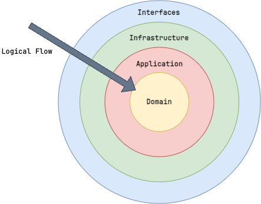

# System Architecture

## Full Stack

This project exemplifies a full stack system architecture inclusive of a frontend User Interface (UI), a backend Application Programming Interface (API) encompassing the core logic, and a data persistence layer.


## Domain-Driven Design

This project adopts and adheres to the [Domain-Driven Design](https://martinfowler.com/bliki/DomainDrivenDesign.html) approach. Our bounded contexts are implemented as modules within the system. Each module adheres to the principles and patterns outlined in DDD, including domain entities, infrastructure repositories, and application services. Module implementations enable loose coupling of system components and an ability to easily extract modules into their own services if necessary. Further, each module is designed to enable the system to implement inversion of control and dependency injection principles.

### Further DDD Reading

- [DDD Reference](https://www.domainlanguage.com/wp-content/uploads/2016/05/DDD_Reference_2015-03.pdf)
- DDD Burger: A [good article](https://medium.com/@remast/the-ddd-hamburger-for-go-61dba99c4aaf), particularly referencing DDD in Go, that I think does a nice job reflecting the various layers as if we were building a hamburger.

## Modular Monolith

*ARE YOU KIDDING ME? WHERE ARE THE MICROSERVICES????* Yeah yeah yeah... well first and foremost, you could think of this project itself as a microservice... but more imporantly, that's not the *intent* of this project. This project intends to focus on developing a well formed full stack system in an easy to understand / learn / develop manner, and introducing microservices would exponentially complicate things. If you would prefer a series of microservices, you can easily separate the SPA and create a series of services leveraging this project as a starting point.


## Layered Clean Architecture

Similar to Domain-Driven Design, we adopt the principles of [Clean Architecture](https://blog.cleancoder.com/uncle-bob/2012/08/13/the-clean-architecture.html) to ensure separation of concerns and maintainability. The system is structured into distinct layers, each with specific responsibilities:

- **Domain Layer**: Contains the core business logic and domain entities. This layer is independent of any external systems or frameworks.
- **Application Layer**: Contains application services that orchestrate domain logic and handle use cases.
- **Interface Layer**: Contains the API controllers and routes that handle incoming requests and responses.
- **Infrastructure Layer**: Contains implementations for data access, external services, and other infrastructure concerns



## Mono Repo Project Layout / Structure

This project is intentionally structured as a monorepo to display how all of the various pieces of the system are stitched together. We can follow the logical flow of the system from frontend view all the way through the backend database queries and every layer in between.

Given the core of the system is defined in Go, we adhere to commonly accepted Go project layout best practices with slight adaptations to suit our needs.

- Directory Structure Reference Point: [https://github.com/golang-standards/project-layout](https://github.com/golang-standards/project-layout)

Root Directory Layout:

```shell
├── api # api
├── app # core application implementation
├── build # build files (dockerfiles)
├── cmd # primary commands for running the application
├── configs # configuration files
├── db # database code (migrations, queries, etc.)
├── deploy # deploy targets
├── docs # documentation site and content
├── examples # example code
├── internal # core logic
├── pkg # go packages, cross-cutting
├── test # e2e tests and test utilities
├── tools # tools for the project
└── vendor # vendor packages  https://go.dev/ref/mod#vendoring
```

### Frontend Vue Layout

The frontend application is defined as an embedded SPA, written in Vue.js, the project layout for the frontend vue application follows the pattern defined here [Vue Reference](https://vue-faq.org/en/development/project-structure.html#suitable-architecture-for-vue-3-web-application)
