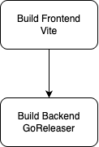

# Building

The backend (core) application is packaged into a single binary, which references the built frontend files

The frontend application is packaged into relevant build files utilizing Vite, output to the `/dist/frontend` directory.

The backend application serves these files according to the logic defined within `/api/frontend/frontend.go`

This rudimentary diagram illustrates the build flow for both the frontend and backend applications. First, the frontend application is built using Vite, producing static files in the `/dist/frontend` directory. Next, the backend application is built using Go, which includes embedding the previously built frontend files. The final output is a single binary that serves both the backend API and the frontend application. These are then built into a Docker container for deployment.

For orchestrating the build process, GoReleaser is utilized. GoReleaser simplifies the build and release process by automating tasks such as compiling the application for multiple platforms, creating Docker images, and generating release notes. The configuration for GoReleaser is defined in the `.goreleaser.yml` file located at the root of the repository.
