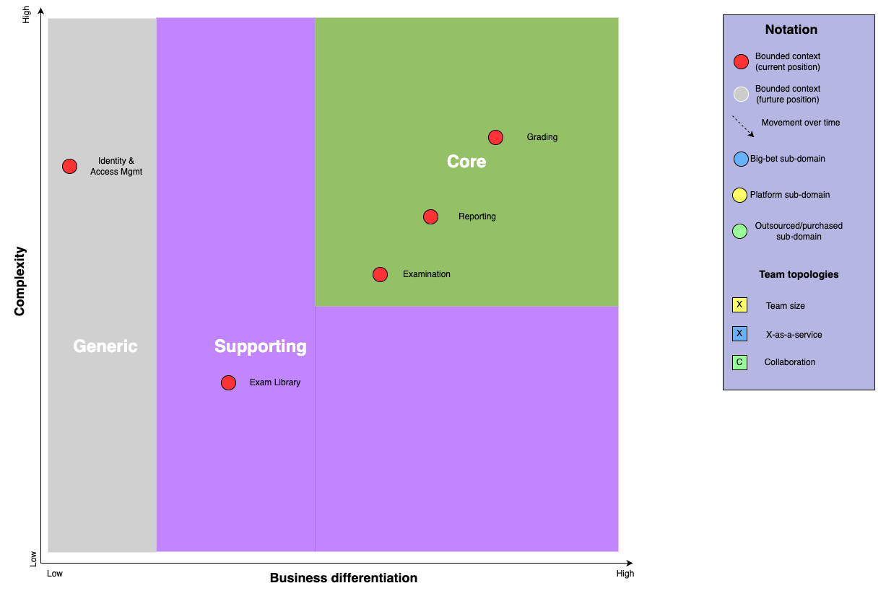

# Making the Grade: Strategize

Strategically map out your sub-domains to identify core domains: the parts of the domain which have the greatest potential for business differentiation or strategic significance.

## Core Domain Chart

## Subdomain Definitions

### Core Subdomains

- Examination: handles taking of standardized tests. We have identified Examination to be a `Core` domain, due to the fact that it has a high level of, and is the primary point of interaction, for Students. It is imperative that we provide this functionality and have the ability to customize and control examination subdomain.
- Grading: handles grading of standardized tests. Given the fact that many of the exams will contain short and long answer questions which are subjectively graded by graders, and without this subdomain, we lose critical functinality of the business requirements of our system.
- Reporting: handles generation and management of reports. Initially thought to be a supporting subdomain, we have further come to an understanding that the potential for insights regarding statistical analysis, trends, identification of weaknesses across school and student demographics, provides a significant amount of value to the business (state), and therefore requires a level of custom development in order to provide relevant and differentiated reports.

### Supporting Subdomains

- Exam Library: manages catalog of tests available within the system. This subdomain has a possibilty to become more strategic and core to our business, however, the differentiator is moreso the breadth of content and less so the functionality of the subdomain from the end user perspective. For the time being, we are solving for a small number of variations in exam content

### Generic Subdomains

- Identity and Access Management: handles authentication, authorization, and management of user profiles. User Identity and Access Management is a commodity capability with a variety of toolsets available to developers. While it is technically required to provide necessary functionality of our system, it does not provide value to our user groups, and is not considered to be core business differentiator to our business.

## Wardley Mapping

