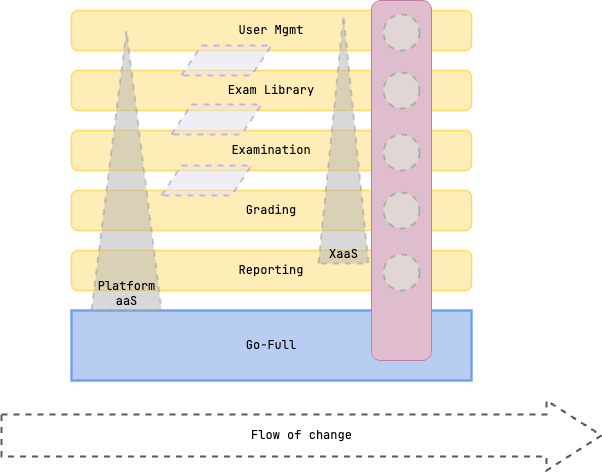

# Making the Grade: Organize

Organize autonomous teams that are optimized for fast flow and aligned with context boundaries.

## Team Topology

We've outlined our team topology to optimize for fast flow, enabling autonomous teams to deliver value quickly.

### Enabling Teams

- Product Architecture Team: Provides architectural guidance, ensures adherence to standards, and supports stream-aligned teams in delivering high-quality solutions.

### Complicated-Subsystem Teams

- None

### Stream-aligned Teams

- **Exam Library Team**: Frontend, Backend/core domain, and Database for Exam Library bounded context.
- **Examination Team**: Frontend, Backend/core domain, and Database for Examination bounded context.
- **Grading Team**: Frontend, Backend/core domain, and Database for Grading bounded context.
- **Reporting Team**: Frontend, Backend/core domain, and Database for Reporting bounded context.
- **User Management Team**: Frontend, Backend/core domain, and Database for User Management bounded context.

### Platform Teams

- The Go-Full Platform Team: Everything outside of bounded context modules. The go-full platform team manages infrastructure, shared services, and cross-cutting concerns to support stream-aligned teams.

### Team Topology In Action: Alignment to Code Ownership

[In order to reinforce and provide a realistic example of our team topology, we've aligned our code ownership structure accordingly.](https://github.com/cooperlutz/go-full/tree/main/.github/CODEOWNERS)

### Why This Works

Scaling software delivery requires more than just technical solutions; it demands an organizational structure that promotes autonomy and fast flow. By organizing teams around bounded contexts and ensuring clear ownership, we enable teams to focus on delivering value without unnecessary dependencies or bottlenecks.

As bounded contexts evolve, and either become more complex or do not require as much dedicated focus, we can adapt our team structures accordingly.

### Less Effective Alternatives

- **Tool-specific Teams**: Organizing teams around specific tools or technologies can create silos, stifle innovation, stall skill development, and hinder collaboration, as teams may become too focused on their specific tool, treating their tools as hammers looking constantly looking for nails, rather than focusing on the overall goals of the business / customer / product.
- **Technical Domain Teams**: While technical domain teams can provide deep expertise, they may struggle to deliver end-to-end value without strong collaboration with other teams, leading to delays and misalignment with business objectives. Its common that technical domain teams become bottlenecks, as other teams must wait for their specialized knowledge to complete tasks.
- **Feature Teams Without Context Boundaries**: While feature teams can be effective, without clear context boundaries, they may face challenges in managing dependencies and ensuring consistent quality across the system. This can lead to duplicated efforts and misaligned priorities, as teams may not have a holistic view of the system.
