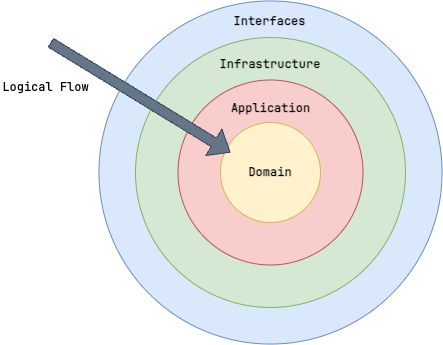

# System Modules

As noted in [ADR-00002](../decisions/00002_system_arch.md), the system architecture adopts a modular monolith approach, adhering to principles of Domain-Driven Design (DDD).

## Architecture Styles

Individual modules are given freedom to choose their architectural style, however, we encourage the adoption of [Clean Architecture](https://blog.cleancoder.com/uncle-bob/2012/08/13/the-clean-architecture.html) or [Hexagonal Architecture](https://herbertograca.com/2017/11/16/explicit-architecture-01-ddd-hexagonal-onion-clean-cqrs-how-i-put-it-all-together/) styles to ensure separation of concerns and promote maintainability.

### Clean Architecture

The module is structured into distinct layers, each with specific responsibilities:

- **Domain Layer**: Contains the core business logic and domain entities. This layer is independent of any external systems or frameworks.
- **Application Layer**: Contains application services that orchestrate domain logic and handle use cases.
- **Interface Layer**: Contains the API controllers and routes that handle incoming requests and responses.
- **Infrastructure Layer**: Contains implementations for data access, external services, and other infrastructure concerns



Reference Module: [Exam Library](https://github.com/cooperlutz/go-full/tree/main/internal/examlibrary)

### Hexagonal Architecture

The module is designed around the concept of ports and adapters, allowing for flexibility and easy integration with external systems:

- **Core Domain**: Contains the business logic and domain entities.
- **Ports**: Define interfaces for communication between the core domain and external systems.
- **Adapters**: Implement the ports to interact with external systems such as databases, APIs, and user interfaces.


Reference Module: [Examination](https://github.com/cooperlutz/go-full/tree/main/internal/examination)
    - [Based on ThreeDotLabs' interpretation via Wild Workouts](https://github.com/ThreeDotsLabs/wild-workouts-go-ddd-example/tree/master)

## Module Structure

Each system module is structured to encapsulate the various layers of the application, ensuring separation of concerns and maintainability. The typical structure of a module is as follows:

### core / backend

```shell
internal/DOMAIN_MODULE
├── api          # Interface Layer: API controllers and routes
├── app          # Application Layer: Application services and use cases
├── domain       # Domain Layer: Core business logic and domain entities
├── infra        # Infrastructure Layer: Data access and external services
└── DOMAIN_MODULE.go  # Module definition and entry point
```

#### Mock Implementations

```shell
test/mocks/DOMAIN_MODULE/
```

In order to configure the relevant mock implementations for use within tests, each *system module* will require updates to the `.mockery` configuration file to outline relevant *system module* packages.

### frontend

```shell
api/frontend/src/DOMAIN_MODULE
├── __tests__   # Tests specific to the module
├── assets       # Assets specific to the module
├── components   # Vue components specific to the module
├── composables  # Vue composables specific to the module
├── configs      # Configuration files specific to the module
├── layouts      # Vue layouts specific to the module
├── router      # Vue router definitions specific to the module
├── services     # Services (API clients) specific to the module
├── stores        # Vuex store modules specific to the module
├── styles       # Styles specific to the module
├── utils       # Utility functions specific to the module
├── views        # Vue views specific to the module
└── DOMAIN_MODULE.ts  # Module definition and entry point
```

### REST API

```shell
api/rest/DOMAIN_MODULE/{version}
├── client # Generated API client for the individual module version
│   ├── cfg.yaml # Configuration for the individual module version server
│   ├── client.gen.go # Generated client code for the individual module version
│   └── generate.go # Code generation script for the individual module version
├── server # Generated API server for the individual module
│   ├── cfg.yaml # Configuration for the individual module version server
│   └── generate.go # Code generation script for the individual module version
└── api.yaml # OpenAPI specification for the individual module version
```

### Database

Note: Migration files must be defined within a consolidated `db/migrations/` directory to ensure proper execution order during migration runs.

#### Migrations

```shell
db/migrations/ # Database migration files
```

#### Queries and Schemas

```shell
db/DOMAIN_MODULE
├── queries  # Database query files specific to the module
└── schemas  # Database schema files specific to the module
```

Additionally, each *system module* will require updates to the corresponding `.sqlc` file to outline the relevant configuration.
