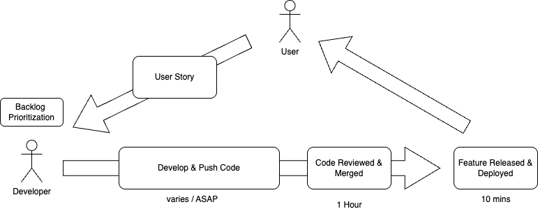

# System Development Workflow

The workflow associated with this project aims to prioritize feature development, code quality, and continuous integration and deployment. The following pseudo Value Stream Map illustrates the overall workflow:

## DORA Metrics

DORA Metrics can be used to measure the performance of software development teams. The four key metrics are:

1. **Lead Time for Change**: The time it takes to go from code committed to code successfully running in production.
2. **Deployment Frequency**: How often an organization successfully releases to production.
3. **Change Failure Rate**: The percentage of changes that result in a failure in production.
4. **Time to Restore Service**: How long it takes to recover from a failure in production.

In order to measure our development performance, a self-assessment based on the DORA (DevOps Research and Assessment) Quick Check has been conducted. View the results of the assessment [here](https://dora.dev/quickcheck/?leadtime=5&deployfreq=6&changefailure=10&failurerecovery=5&v=2024&industry=all&ci=55555&arch=444555&culture=555555&step=priorities#results).
