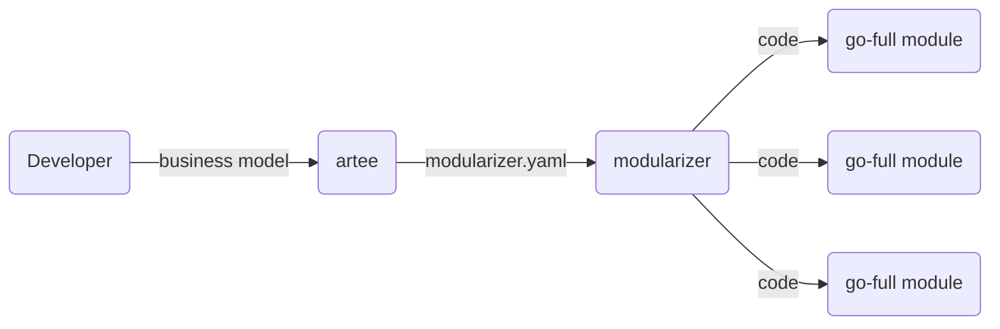

# Tools

## Modularizer - Module Generator

Modularizer is a tool that helps you to generate modules that fit into Go-Full's modular architecture. It provides the ability to create new Go-Full compatible modules with a predefined yaml based structure and generates the necessary boilerplate code for you. This allows you to focus on implementing the core functionality of your module without worrying about the underlying structure.

[Example Modularizer Config](./modularizer/modularizer.yaml)

## Artee - Business Model Modularizer

Artee is a tool that provides the ability to define your higher level business model in a markdown file and then utilizes ai to generate the relevant modularizer yaml files. This allows you to quickly and easily create modules that are tailored to your specific business needs without having to manually write the yaml files yourself.

[Example Business Model](./artee/pet_clinic/business_model.md)
[Example Generated Modularizer Domain Model](./artee/pet_clinic/domain_model.yaml)

## Summary

Together, this enables the following workflow:

1. Define your business model in a basic markdown file.
2. Use Artee to generate the corresponding domain model with the associated aggregates, commands, events, queries in a format consumable by Modularizer.
3. Use Modularizer to create new modules based on the generated yaml files.
4. Develop e2e tests for your modules to ensure they work as expected.
5. Implement domain logic
6. Customize UI
7. Implement the generated modules and integrate them into your application.

## Value Proposition

- Ensures the starting point is the overarching business model
- Minimizes the need for costly AI code generation for adapters / interfaces / translations / app composition
- Focuses development efforts on the most critical product elements: e2e testing, domain logic, and ui
- Doesn't abstract away the underlying logic and enables a the ability to implement a high level of customization at each layer
